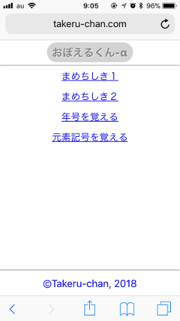
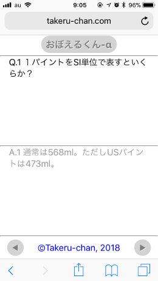

# Web app for memorization.

## What's this? | これはなに？

単語や短文などを覚えるためのWebアプリです。  

## Usage | つかいかた

iPhoneのブラウザでアクセスします。  
動作サンプル：[おぼえるアプリ(iPhone用)](http://nevertoolate.date)  

メインメニュー画面で覚えたい単語や短文リストのリンクを選択します。  

<div style="float:left; margin-right:1em; margin-bottom:1em;"></div>


<div style="clear:both;">単語または短文表示画面の上半分に表示された内容に対応する内容が下半分に隠されています。
下半分の内容はそのエリアをタッチしている間だけ表示されます。  </div>

次の単語または短文を表示したいときは「&#9654;」、前の単語または短文を表示したいときは「&#9664;」ボタンを選択します。
メインメニュー画面に戻るときはタイトルの「おぼえるくん-α」ボタンを選択します。  

## Settings | 設定方法

### ファイル配置

phpが動作するWebサーバーのドキュメントルート以下にプログラムファイルoboeru.phpとメニュー設定ファイルoboeru.listを配置します。  

データファイルはプログラムファイル配置ディレクトリ内にデータディレクトリを配置し、データディレクトリ下にdata.*（*は連続する自然数および0）というファイル名で配置します。  

- \[prog_dir\]
    - oboeru.php
    - oboeru.list
    - \[data_dir\]
        - data.0
        - data.1
        - ...
        - data.n

### データファイル

１ファイルあたり１画面分のデータです。１行目の内容が上半分に、２行目の内容が下半分に表示されます。  

<div style="float:left; margin-right:1em; margin-bottom:1em;"></div>

```
Q.1 １パイントをSI単位で表すといくらか？
A.1 通常は568ml。ただしUSパイントは473ml。
```

文字コードはuft-8で作成してください。  

### メニュー設定例

oboeru.list内にデータセットの名称とデータディレクトリ名、データファイルの番号などをカンマ区切りで指定します。
\#で始まる行はコメント行として無視されます。  

同一データディレクトリ内のデータに異なるデータセット名称を指定することもできるし、異なるデータディレクトリでデータセットを分けて管理することもできます。  

<div style="float:left; margin-right:1em; margin-bottom:1em;"></div>

```
# データセット名,ディレクトリ名,最小値,最大値,初期表示値,表示モード
まめちしき１,mame,0,9,0
まめちしき２,mame,10,19,10
年号を覚える,nengo,0,49,
年号を覚える（ランダム）,nengo,,,-1
元素記号を覚える,genso,0,118,-1,letter
# 最小値を省略した場合は指定ディレクトリ中の最小のdata.*を最小値とみなします。
# 最大値を省略した場合は指定ディレクトリ中の最大のdata.*を最大値とみなします。
# 初期表示値を省略した場合は最小値を初期表示値とみなします。
```

上記例ではmameディレクトリ下にあるdata.0からdata.9までを「まめちしき１」のひとかたまりとしてdata.0から順に表示します。
data.9まで表示したら次の表示はdata.0に戻ります。  

同じmameディレクトリ下にあるdata.10からdata.19までは「まめちしき２」のひとかたまりとしてdata.10から順にdata.19まで表示します。  

「年号を覚える」のデータはnengoディレクトリ下に0から49まで50個あります。
初期表示値が負数の場合はデータ表示順はランダムになります。  

「元素記号を覚える」のデータのように文字数が少ないものは、初期表示値の後ろにletterキーワードを付けることで大きなフォントで表示することができます。  

## License

This code has released under the MIT license.  
[http://opensource.org/licenses/MIT](http://opensource.org/licenses/MIT)

## TODO list

- [ ] 階層メニュー対応
- [ ] 階層メニュー戻る経路
- [x] データセット上限値の自動設定
- [x] 初期表示値の自動設定
- [ ] 画像対応
- [ ] 再読み込みなし（DOM書き換え）
- [ ] データベース対応
